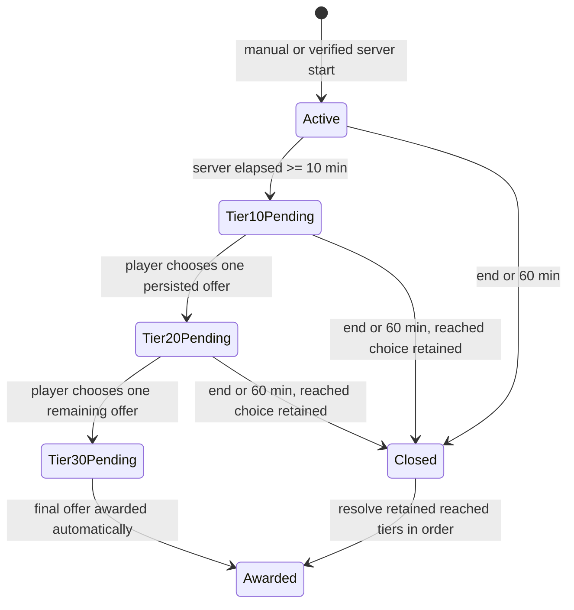
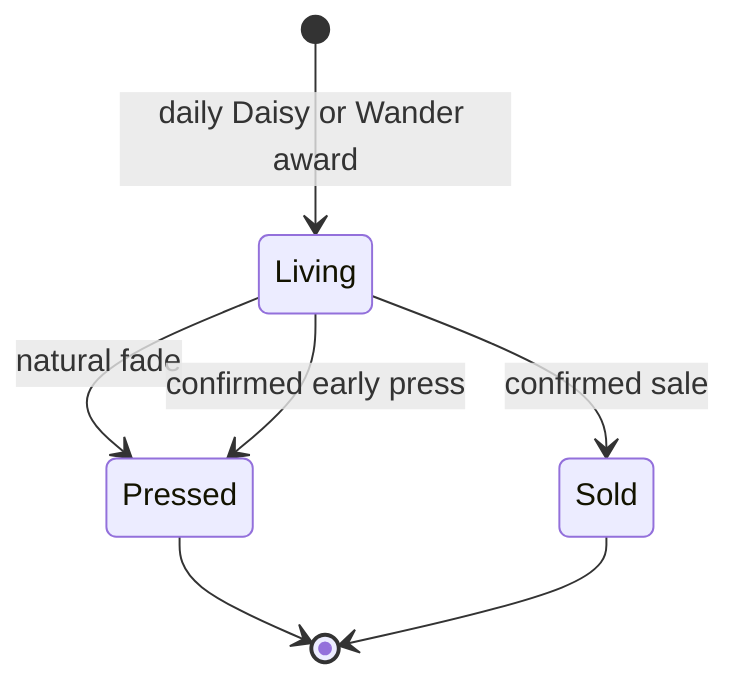
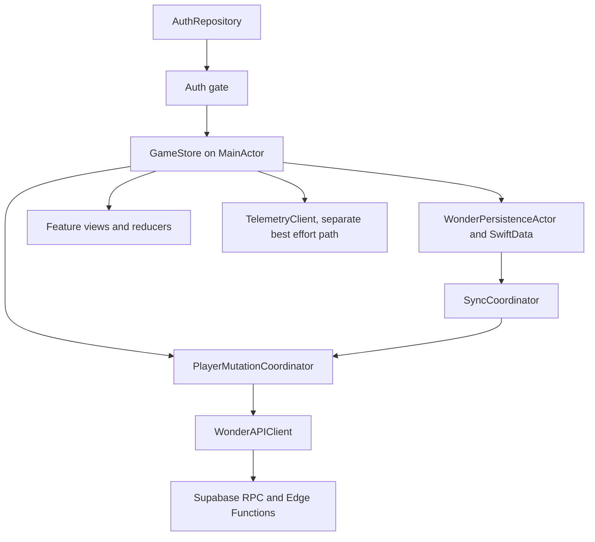

# Wander Wonders V1 旧项目进度与迁移审计

- **审计日期：** 2026-08-12
- **新项目：** `/Users/claudia/Documents/Claude/Projects/20260812_wander_wonders_v2_LH`
- **旧项目：** `/Users/claudia/Documents/Claude/Projects/20260801_wander_wonders_v1`
- **产品基线：** `WanderWonders_Complete_Product_Spec.md`
- **文档性质：** 只读进度盘点和迁移前交接，不是已批准的实施计划

## 1. 结论先行

旧项目不是“App 功能已做一半”，而是“后端域模型和本地工程基础做得较深，iOS 产品层几乎未开始”。

- 按 V5 工程里程碑计数：Step 1–4 完成，即 **4/14 = 28.6%**；Step 5 工程校验完成，但艺术/所有者门禁未过。如给 Step 5 部分权重，基础工程约在 **30%–35%**。
- 按用户可体验的 V1 验收计数：规格第 26 章的 10 类验收中，**0/10 有端到端证明**。当前 App 只能显示启动占位页。
- 按后端源码表面：22/22 张计划数据表和 24/24 个计划对外 RPC 入口已存在，后端主干应保留，不建议重头写。
- Edge Functions 为 **0**，生产美术文件为 **0**，iOS 业务 Swift 源码只有 44 行，且没有 DTO、API、Auth、SwiftData、同步、业务页面或系统能力适配器。
- 最大的工程风险不是代码设计，而是 **旧实现几乎全是 Git 未跟踪文件**。旧仓库的提交历史不是这些实现的备份，迁移前不应删除、重置或清理旧目录。

## 2. 审计边界与证据等级

### 本轮范围

- 将新目录产品规格与旧项目代码、迁移、测试、脚本和历史计划对照。
- 识别已完成、部分完成、未开始、可保留、需重写和不应迁移的内容。
- 提取旧项目已实现的逻辑主干，并分离“代码已存在”与“计划中打算这样做”。

### 本轮明确不做

- 不搬运、重写或继续产品代码。
- 不修改旧项目。
- 不启动 Docker/Supabase 本地栈，不运行 Xcode 构建或模拟器。
- 不查询或修改远端 Supabase、Apple、Google、App Store Connect 或 TestFlight。
- 不把历史计划中记录的过去测试结果宣称为 2026-08-12 的当前通过证据。

### 证据等级

| 等级 | 含义 | 本文用法 |
|---|---|---|
| A | 2026-08-12 本轮直接检查或执行 | 文件内容、Git 状态、精确比较、两个轻量 Swift 内容校验 |
| B | 旧 V5 计划中记录的 2026-08-01/02 执行证据 | 可证明“当时记录为通过”，不代表本轮重跑 |
| C | 未检查的外部或端到端状态 | 远端数据库、Provider、真机、TestFlight、上线准备 |

## 3. 规格基线

### 已验证事实

- 新目录 `WanderWonders_Complete_Product_Spec.md` 与旧目录 `WanderWonders_Complete_Product_Spec_V2.md` **字节级一致**；`cmp` 返回 0。
- 因此旧实现和 V5 计划没有遇到“新规格已换版”的基线偏移。
- 新目录当前只有规格、两行 README 和本文档，没有产品代码基线。
- 规格第 27.2 节仍把花瓶槽位和外观价格列为 Beta 校准问题；旧 V5 计划与种子采用 `600/1800/0/150/200 Glow` 作为可测试假设，不应将其视为永久商业定价。

## 4. 总体进度看板

| 领域 | 已存在内容 | 当前判定 | 证据等级 |
|---|---|---|---|
| 产品规格 | 1,560 行完整 V1/V2/V3 产品和业务规格 | 完成，且新旧一致 | A |
| Step 0 外部准备 | 7 份 readiness 模板与 `.env.example` | 模板完成；账号、URL、密钥状态、艺术合同均未完成 | A/C |
| Step 1 iOS 工程 | XcodeGen、Swift 6/iOS 17、两个 target、启动页和 2 个微型测试 | 工程骨架完成；产品功能未开始 | A/B |
| Step 2 本地 Supabase | 独立端口、reset/start/stop/check 脚本、Postgres 17 配置 | 源码完成；本轮未启动本地栈 | A/B |
| Step 3 数据模型和安全 | 22 表、约束、索引、FORCE RLS、直接表权限撤销、不可变触发器 | 源码完成；历史记录 19/19 通过 | A/B |
| Step 4 后端域操作 | 24 个对外 RPC、18 个私有 helper、修订号、幂等、锁、超时、离线同步、经济/生命周期/休眠/步数 | 源码主干完成；历史记录基础+RPC 59/59 通过 | A/B |
| Step 5 目录和内容工程 | 13 个花种、5 个商店项、50 个资产集清单、生成器、种子、离线序列 fixture | 结构和种子校验完成；生产艺术 0/50 | A |
| Step 6 Edge Functions | 仅 `.env.example` | 未开始；0 个 TypeScript 函数 | A |
| Step 7–8 iOS 数据层 | V5 中有详细设计 | 代码未开始 | A |
| Step 9–12 iOS 体验 | 只有 `LaunchView` 占位页 | 未开始 | A |
| Step 13 完整验证 | 部分早期脚本和 SQL 测试 | 未开始；没有统一 `run_wonder_checks.sh` 和归档验证 | A |
| Step 14 部署/TestFlight | 无当前证据 | 未开始/未验证 | C |

## 5. 已经搭好的逻辑框架

### 5.1 已实现的后端主干

```mermaid
flowchart LR
    A["Authenticated RPC call"] --> B["auth.uid and input validation"]
    B --> C["Idempotency request row"]
    C --> D["Per-user advisory lock"]
    D --> E["Profile and resource row locks"]
    E --> F["Server-side domain validation"]
    F --> G["Atomic state, ledger, and event writes"]
    G --> H["One state revision increment"]
    H --> I["Typed snapshot or delta response"]
    I --> J["Stored response for replay"]
```

这条主干已在 SQL 中实现，不只是计划：

1. `auth.uid()` 决定当前 owner，客户端不能提交权威 owner、价格、余额、花期或每日数量。
2. `wonder_idempotency_keys` 保存规范化请求和响应，相同 UUID 可重放，同 UUID 不同 payload 拒绝。
3. 修改型 RPC 采用每用户顺序锁、资源行锁、`state_revision` 和原子交易。
4. `wonder_bootstrap`/`wonder_refresh_state` 返回完整 snapshot，其他业务操作返回 typed delta/error envelope。
5. 22 张表全部启用并强制 RLS，直接表访问对 `public/anon/authenticated` 撤销，只开放审查过的 RPC 签名。
6. 账本和关键事件通过触发器禁止 update/delete，用户删除关系从 `auth.users` 级联到 owner 数据。

### 5.2 已实现的业务状态机

#### Wander

- 在线/手动开始在一个事务内建立 session、3 个 persisted offers 和最多 3 个每日配额预留。
- `wonder_reconcile_wander` 以服务器时间计算 10/20/30/60 分钟阈值，客户端时钟不是权威。
- 10 分钟选 3 中 1，20 分钟选剩余 2 中 1，30 分钟自动发放最后 1 个。
- 60 分钟关闭 session，只释放未达到的预留，已达到但未选的奖励仍可按顺序解决。
- 完全离线开始使用 catalog v1 + session UUID 的确定性 SHA-256 序列；回线后服务器重算并逐 tier 接受或用 `WW_DAILY_FLOWER_CAP` 永久拒绝。

#### Flower / Pocket / Pressbook

- 所有 living flowers 都属于 Pocket，花瓶只是 assignment，不是另一个库存。
- natural fade/early press 进入 Pressbook 计数，sold 不进 Pressbook。
- 终态转换在服务器内只发生一次，并在同一事务内移除花瓶 assignment、写 event/账本和返回 delta。
- Sunshine 只允许对 displayed + living + non-Hibernate 花操作，扣 20 Glow，增加 86,400 秒，可叠加。

#### Glow / Steps / Hibernate

- `wonder_glow_ledger` 是不可变经济账本，`wonder_profiles.glow_balance` 是在交易内维护的当前余额。
- 出售价值由服务器根据剩余天数重算；客户端提交的值只是确认 guard。
- 每日步数保留 Health 和 fallback 的 high-water，目标 Glow 是 `floor(max(health, fallback) / 100)`，只补正差额，不重复发放。
- Hibernate 以开闭区间保存；退出时一次性延长 living flower deadline，避免休眠期间的花期和步数被计入。

### 5.3 已设计但未实现的 iOS 框架

这个分层在 V5 计划中已经详细决策，但旧目录内没有对应 Swift 实现。不能把这一部分计入已完成进度。

## 6. V1 验收条目映射

| 规格验收类别 | 已有基础 | 主要缺口 | 结论 |
|---|---|---|---|
| 26.1 Accounts | identity/profile/settings 表，`wonder_auth_gate`，关联审批 RPC | Apple/Google iOS Auth、Edge 删除、恢复会话、界面、真实 provider 验证 | 后端基础部分完成 |
| 26.2 Daily Daisy | `wonder_bootstrap`、daily grant 唯一键、Hibernate 条件 | iOS bootstrap/缓存/UI/离线文案 | 后端基础部分完成 |
| 26.3 Wander start | manual/verified server start RPC、accepted park config | Places Edge Function、Core Location、权限和手动 fallback UI | 后端基础部分完成 |
| 26.4 Timing/rewards | session/offer/reward 表、服务器 reconcile、预留、每日 cap、离线 sync RPC | iOS timer、持久化、tier 选择/恢复 UI、断网端到端证明 | 后端主干完成，产品未完成 |
| 26.5 Pocket/vases | flower/vase 表和 assign/remove RPC | Pocket、Home、overflow prompt、vase UI/乐观 overlay | 后端基础部分完成 |
| 26.6 Lifecycle | press/sell/sunshine/expiry 域逻辑和账本 | 倒计时、确认对话、过期/价格变化 UI、背景恢复 | 后端主干完成，产品未完成 |
| 26.7 Pressbook | discoveries/shelf 表和 RPC | Pressbook 界面、花架、首次发现呈现 | 后端基础部分完成 |
| 26.8 Steps/glow | step-credit 表、ledger、`wonder_sync_steps` | HealthKit/Core Motion、区间查询、权限、后台队列、真机证明 | 后端基础部分完成 |
| 26.9 Hibernate | interval 表、enter/exit RPC、业务拦截 | iOS 界面、持久化、通知/倒计时协调、真机时间证明 | 后端基础部分完成 |
| 26.10 Privacy/security | FORCE RLS、RPC-only、owner/FK、不可变事件、无原始位置/Health 字段 | Places/删除隐私流、App privacy manifest/data map、远端审计、真实应用包扫描 | 数据库基础较强，发布门禁未满足 |

## 7. 哪些应保留

### A. 建议原样迁入新仓库，再在新仓库复验

| 内容 | 原因 | 迁入后最小复验 |
|---|---|---|
| `supabase/migrations/*.sql` | 已形成完整的 22 表 + 域 RPC 主干 | 两次本地 reset、pgTAP、lint、并发/超时 probe |
| `supabase/tests/database/*.sql` | 覆盖表数、权限、约束、RPC、目录和经济行为 | 先跑 19 个 schema tests，再跑完整 85 个计划断言 |
| `Content/*.json` | 目录、配置、离线 fixture 和 50 项资产合同已互相对齐 | 本轮两个 Swift 校验已通过；迁入后重跑一次 |
| `Scripts/generate_wonder_seed.swift` | JSON 作为单一源，生成 SQL/fixture | `--check` |
| `Scripts/validate_wonder_assets.swift` | 已定义资产结构合同 | 结构校验；艺术到位后增加文件实体验证 |
| 本地 Supabase 脚本和 `config.toml` | 已避免现有本地栈端口冲突，并防止对 linked checkout 误 reset | CLI 当前版本和 `--help`、无 link marker、两次 reset |
| `project.yml`、Config examples、toolchain/build 脚本 | Swift 6/iOS 17 骨架简单，没有第三方 Swift 依赖 | 在新目录重新生成 Xcode 项目，Debug/Release/test |
| `docs/wonder_data_dictionary.md` 和 readiness 文档 | 保留设计理由、owner-only 门禁和隐私边界 | 更新状态，不复制任何密密值 |

### B. 保留逻辑，但不把当前形式当成最终产品

- `WanderWondersApp.swift` 和 `LaunchView.swift`：可作为新 App 入口和 loading surface 起点，但没有可保护的业务代码。
- V5 中的 `AuthRepository` / `WonderAPIClient` / `WonderPersistenceActor` / `PlayerMutationCoordinator` / `SyncCoordinator` / `GameStore` 边界：保留作为实施基线，但必须诚实标注为“未实现”。
- `wonder_role_timeouts.sql`：保留候选逻辑，但它会改变 `authenticated` 和 `service_role` 的项目级超时。在任何远端应用前，必须先确认该 Supabase 项目确实专用，并记录现有 role settings 和回滚值。
- V5 的完整策略和测试矩阵：继续作为主计划候选，但应在 Claude 审阅后再决定是直接搬入还是基于它写一份新的、独立的执行计划。

## 8. 哪些需要新写或实质完成

1. `supabase/functions/wonder-park-check` 和 `wonder-delete-account`：当前没有 TypeScript 实现或 Deno 测试。
2. iOS DTO、typed error/envelope、Supabase Auth/RPC/Edge 网络层。
3. SwiftData schema、cache actor、持久化 operation queue、每用户权威 mutation serializer、同步和进程终止恢复。
4. Onboarding、Home、Pocket、Pressbook、Shop、Settings 和完整的 Wander 界面。
5. Core Location + Places 检查和手动 fallback。
6. HealthKit + Core Motion + Hibernate 区间扣除和真机验证。
7. 通知、后台/强退恢复、时钟变化、时区和 DST 边界。
8. Settings 中的 sign-out/link/delete/privacy/support 流程、`PrivacyInfo.xcprivacy` 和 data map。
9. 50 套真实艺术、资产 catalog 导入、可访问性和最终 app icon。
10. 统一本地验证 runner、应用归档、真机、远端、TestFlight 和回滚证据。

## 9. 哪些不应搬

- `.build/` 和任何 DerivedData、xcresult、中间产物。
- 旧 `.git/`；新目录已有自己的 Git 历史。
- `.DS_Store`、`supabase/.temp/`、`supabase/.branches/`和任何本地 link/runtime 状态。
- 由 XcodeGen 可重生的 `WanderWonders.xcodeproj/`；保留 `project.yml` 并在新目录生成。
- 任何真实 xcconfig、token、key、`.p8`、OAuth code、tester email 或 provider response。只搬 safe example 文件。
- V1–V4 旧实施计划作为执行依据。如需保留，只当历史资料；V5 才是旧项目的主计划。
- 旧规格的重复副本作为新仓库第二个真相源。新目录现有规格就是同一内容。

## 10. Git 和保全风险

### 已验证状态

- 旧仓库 HEAD 仅有规格、DOCX 和计划文档历史。
- `WanderWonders/`、`supabase/`、`Content/`、`Scripts/`、测试、配置和文档等实现主体都是 untracked 目录/文件。
- `.gitignore` 和 V5 计划本身还有未提交修改；V5 中的 Step 1–5 执行证据正在这些未提交修改里。
- 对实现路径进行定向 Git 历史搜索，没有发现对应提交；不能从 Git 恢复这些实现。

### 搬运时必须遵守

1. 旧目录保持原状，不运行 reset/clean/checkout 或自动格式化。
2. 只做窄路径 copy，显式排除第 9 节的产物；不用带 `--delete` 的同步。
3. 新目录完成文件清单 diff 后，先在新仓库建立可恢复的 Git 基线，再开始改写。
4. 在新仓库复验完成前，旧目录保留为只读安全副本。

## 11. 本轮直接验证结果

| 验证 | 结果 | 说明 |
|---|---|---|
| 新旧规格 `cmp` | PASS | 字节级一致 |
| Catalog generator `--check` | PASS | 13 active species，12 Autumn offers，5 shop items，canonical offline order |
| Asset manifest structural validator | PASS | 50 sets，39 catalog flower states，`filesChecked=false` |
| 真实生产艺术存在性 | FAIL/NOT PRESENT | `Content/` 中没有 PNG/JPEG/PDF/SVG 艺术文件 |
| Edge Function TypeScript inventory | NOT PRESENT | 0 个 `.ts/.tsx` |
| iOS 产品业务库存 | NOT PRESENT | 仅 App 入口和 LaunchView，生产 Swift 共 44 行 |
| 当前本地 DB tests | NOT RUN | 避免本轮启动 Docker 和修改旧工作区 |
| 当前 Xcode build/tests | NOT RUN | 本轮只做进度文档 |
| 远端 Supabase/provider/TestFlight | UNVERIFIED | 本轮没有连接器或远端查询 |

## 12. 证据索引

| ID | 来源 | 直接观察 | 推论 |
|---|---|---|---|
| E1 | `WanderWonders_Complete_Product_Spec.md:1-1560` | 新规格是完整 V2.0 产品基线 | 可作为唯一产品真相源 |
| E2 | `cmp` 新规格与旧 `WanderWonders_Complete_Product_Spec_V2.md` | 返回 0 | 无规格内容偏移 |
| E3 | `../20260801_wander_wonders_v1/WanderWonders/App/WanderWondersApp.swift:1-12` 和 `Features/Launch/LaunchView.swift:1-32` | 只有 App 入口与 Autumn 占位页 | iOS 产品层未开始 |
| E4 | `../20260801_wander_wonders_v1/project.yml:1-67` | Swift 6/iOS 17、app/unit/UI targets、safe config | 工程骨架可保留 |
| E5 | `../20260801_wander_wonders_v1/supabase/migrations/20260802062348_wonder_initial_schema.sql:23-433` | 22 个 `wonder_*` 表、约束、索引、触发器、FORCE RLS/撤权循环 | 数据层主体已实现 |
| E6 | `../20260801_wander_wonders_v1/supabase/migrations/20260802063506_wonder_domain_functions.sql` | 24 个 public RPC 入口、18 个 private helper、显式 grant allowlist | 后端域操作主干已实现 |
| E7 | `../20260801_wander_wonders_v1/supabase/tests/database/*.sql` | pgTAP plan 为 19 + 40 + 26 = 85 | 已有较完整的本地 DB 回归资产，但本轮未执行 |
| E8 | V5 `:855-931` 执行备注 | 记录 Step 1–4 通过和 Step 5 工程部分通过 | 只作历史 B 级证据 |
| E9 | `Content/flower_catalog.v1.json` + 本轮 generator | 13/12/5 和离线顺序校验通过 | 目录/种子工程可保留 |
| E10 | `Content/wonder_asset_manifest.v1.json` + 本轮 validator | 结构为 50 套，但 `filesChecked=false` | 只有合同，没有生产艺术 |
| E11 | 旧仓库 `git status --short`/`git ls-files` | 实现主体 untracked，V5 执行备注未提交 | 迁移与备份是第一优先级 |
| E12 | 旧仓库定向 `git log -- ...` | 实现路径无提交历史 | 无法用 Git 恢复当前实现 |

## 13. Claude 审阅建议关注点

1. 是否同意“后端主干已成，iOS 产品几乎未开始”的总体判定。
2. 对可保留的 SQL/RPC 进行正确性审查，特别是幂等、revision、每日 cap、离线 tier 解决、Hibernate 和账本原子性。
3. 审查 role-level 5s timeout 对专用 Supabase 项目的爆炸半径和回滚条件。
4. 审查 V5 对 iOS 的 actor/serializer/persistence 分层是否过度设计；在不破坏离线、幂等和数据安全的前提下，应删除不必要抽象。
5. 确认迁移策略为“保留已有后端/内容工程，新写 iOS/Edge 产品层”，而不是全项目重写。
6. 决定 V5 是否可继续作为新仓库的主执行计划；如不可，下一轮应根据 Claude 反馈生成新的、独立的计划，不在旧计划上追加模糊补丁。

## 14. Claude 审阅后的推荐顺序

1. 根据 Claude 反馈修正本进度判定和保留/重写边界。
2. 生成精确迁移清单，从旧目录窄路径复制到新目录，显式排除构建产物和本地 Supabase 状态。
3. 在新仓库立即建立可恢复 Git 基线，旧目录保持只读。
4. 先复验已搬基础：目录校验 → schema tests → 完整 DB tests/probes → XcodeGen + 最小 build/test。
5. 复验通过后再从第一个真正未完成的阶段继续：Edge Functions → iOS 数据层 → 功能 UI → 系统能力 → 完整本地/真机/发布门禁。

## 15. 完成定义

- [x] 新旧产品规格已精确对比。
- [x] 旧项目 Git 状态和恢复风险已记录。
- [x] 已实现后端、内容、iOS 和外部准备已分开计算。
- [x] 计划中未实现的 iOS 架构已与实际代码区分。
- [x] 可保留、需新写、不应搬的范围已给出。
- [x] 本轮只创建本进度文档，未搬运或修改产品代码。
